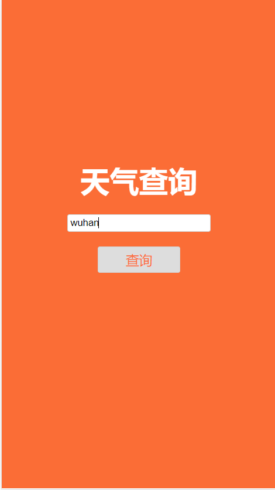
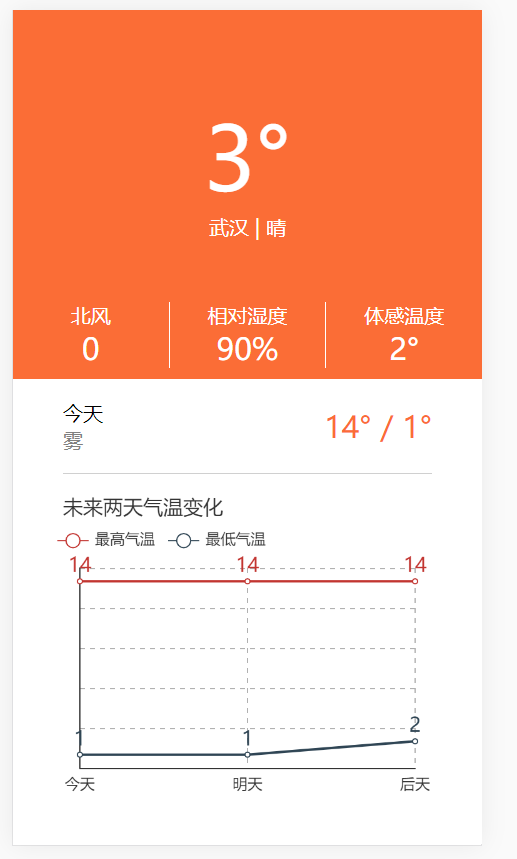

# crawler weather

 查询城市天气 获取数据  数据可视化

### MVC 模式
- model
    - 后端 文件 crawler.js 获取天气数据 
    - 获取 现在 getNowWeather
    - 获取 将来 getForecastWeather
    
- controller  
    - 数据处理 提取有用的信息
    
- view    
    - 数据可视化
    - 百度EChart
 
### server 服务端程序

- 路由 
```javascript
const routeModules = [
    './route/index',
    './route/weather',
]
importRoutes(app, routeModules)
```
- index.js
```javascript
const routes = [
    index,
]
```
- weather.js
```javascript
const routes = [
    now,
    forecast,
]
```

-  注意

 ```javascript
// 配置静态文件
app.use(express.static('static'))
// 文件包含  css  js
```

 
###  weather 截图：



